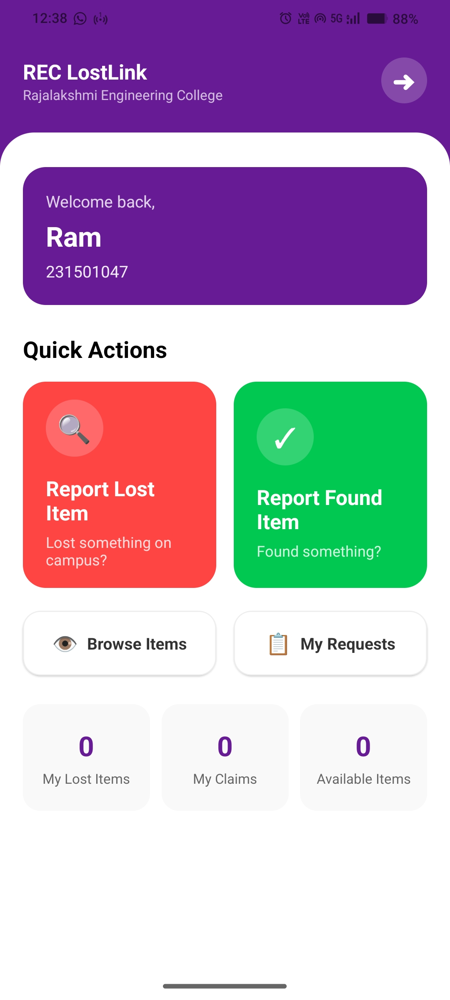
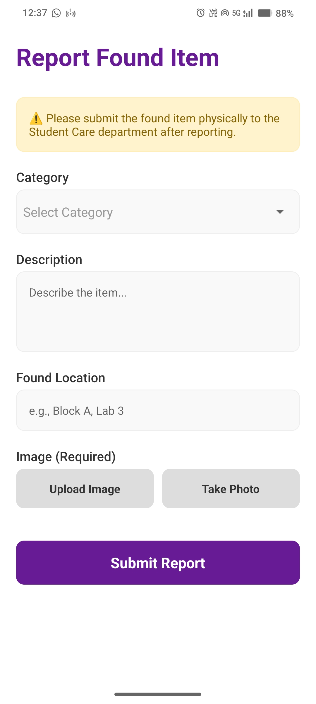
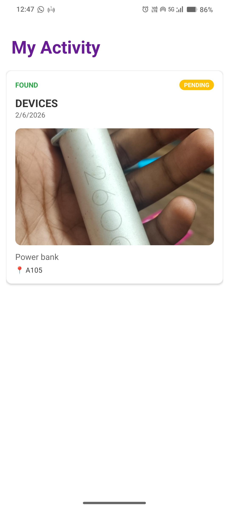
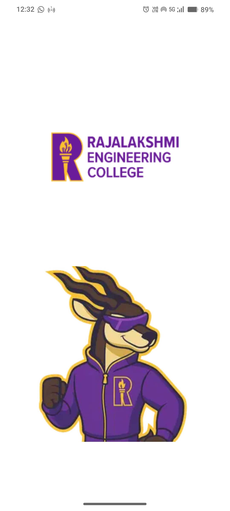
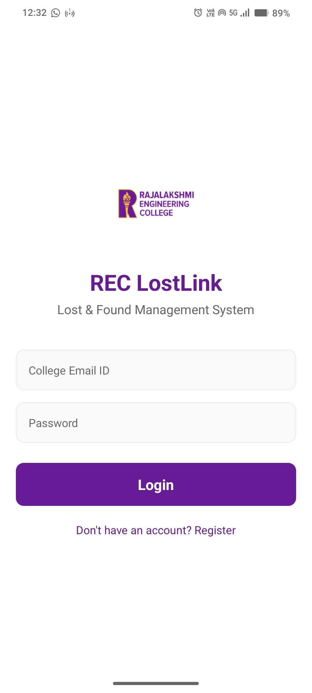
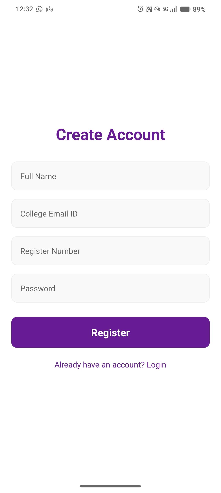

# REC LostLink

## Description / About:
REC LostLink is a comprehensive **Lost & Found** mobile application designed specifically for **Rajalakshmi Engineering College (REC)**. It bridges the gap between students who lose their belongings and those who find them. 

The application provides a seamless platform for:
- **Reporting Lost Items:** Students can post details about items they have lost, including images, descriptions, and last seen locations.
- **Reporting Found Items:** Good Samaritans can report items they have found, ensuring they reach the Student Care department.
- **Claiming Process:** A secure claim process managed by administrators.
- **Admin Management:** A dedicated admin panel for verifying claims and managing the inventory of found items.

Built with a focus on ease of use, security, and college branding, REC LostLink aims to digitalize and streamline the traditional lost and found process on campus.

## Features
- **User Authentication:** Secure Login and Registration for students with Roll Number validation.
- **Smart Dashboard:** Personalized dashboard showing recent activity and status of reported items.
- **Image Recognition:** Upload or Capture photos of lost/found items with camera integration.
- **Status Tracking:** Real-time updates on reported items (Pending, Approved, Returned).
- **Admin Panel:** Complete management system for Admins to view all items, verify claims, and manage student requests.
- **Search & Filter:** Easy navigation to find specific items based on categories (Electronics, IDS, Keys, etc.).

## Screenshots / Demo

## Gallery

<table width="100%">
  <tr>
    <td align="center" valign="top" width="33.33%">
      <b>Home</b><br><sub>App overview</sub><br>
      
    </td>
    <td align="center" valign="top" width="33.33%">
      <b>Report Item</b><br><sub>Lost & Found Forms</sub><br>
      &nbsp;│&nbsp;
    </td>
    <td align="center" valign="top" width="33.33%">
      <b>My Activity</b><br><sub>Tracking Status</sub><br>
      &nbsp;│&nbsp;
    </td>
  </tr>
  <tr>
    <td align="center" valign="top" width="33.33%">
      <b>Admin Panel</b><br><sub>Management</sub><br>
      &nbsp;│&nbsp;
    </td>
    <td align="center" valign="top" width="33.33%">
      <b>Splash Screen</b><br><sub>Branding</sub><br>
      
    </td>
    <td align="center" valign="top" width="33.33%">
      <b>Login</b><br><sub>Auth Screen</sub><br>
      &nbsp;│&nbsp;
    </td>
  </tr>
</table>

## Tech Stack
**Frontend (Mobile App)**
- **Framework:** React Native (Expo)
- **Language:** JavaScript
- **Styling:** StyleSheet, Custom Theme Constants
- **Navigation:** React Navigation (Stack)
- **State Management:** React Context API

**Backend (API)**
- **Framework:** FastAPI (Python)
- **Database:** MongoDB
- **Authentication:** JWT (JSON Web Tokens)
- **Image Handling:** Static file serving

## Installation / Setup

### Prerequisites
- Node.js & npm
- Python 3.8+
- MongoDB (Local or Atlas)
- Expo Go App (on mobile) or Android Simulator

### 1. Clone the Repository
```bash
git clone https://github.com/yourusername/rec-lostlink.git
cd rec-lostlink
```

### 2. Backend Setup
Navigate to the backend directory and set up the Python environment.
```bash
cd fastapi-backend
# Create virtual environment
python -m venv venv
# Activate virtual environment
# Windows:
venv\Scripts\activate
# Mac/Linux:
# source venv/bin/activate

# Install dependencies
pip install -r requirements.txt
```

### 3. Frontend Setup
Navigate to the frontend directory and install Node dependencies.
```bash
cd ../frontend
npm install
```

## Environment Variables
Create a `.env` file in the `fastapi-backend` directory (if required by updated code, currently configured in code).

**Frontend Configuration:**
Update the `src/services/api.js` file with your local IP address if running on a physical device.
```javascript
// src/services/api.js
const BASE_URL = 'http://YOUR_IP_ADDRESS:8080/api';
```

## Usage / Run Commands

### Start the Backend
```bash
cd fastapi-backend
uvicorn app.main:app --reload --host 0.0.0.0 --port 8080
```
The API will be available at `http://localhost:8080`.

### Start the Mobile App
```bash
cd frontend
npx expo start --clear
```
- Press `a` to open in Android Emulator.
- Scan the QR code with Expo Go on your phone.

## Folder Structure
```
rec-lostlink/
├── fastapi-backend/     # Python FastAPI Server
│   ├── app/
│   │   ├── api/         # Route Handlers (auth, items, claims)
│   │   ├── core/        # DB Configuration
│   │   ├── models/      # Pydantic Models
│   │   └── main.py      # Entry Point
│   ├── static/          # Uploaded Images
│   └── requirements.txt
│
├── frontend/            # React Native Expo App
│   ├── assets/          # Images & Icons
│   ├── src/
│   │   ├── components/  # Reusable UI components
│   │   ├── context/     # Auth & Global State
│   │   ├── navigation/  # Navigators (Stack)
│   │   ├── screens/     # Application Screens (User & Admin)
│   │   ├── services/    # API Axios Instance
│   │   └── constants/   # Theme & Colors
│   ├── App.js           # Root Component
│   └── package.json
└── README.md            # Project Documentation
```

## API Details
| Method | Endpoint          | Description               |
| :---   | :---              | :---                      |
| POST   | `/api/auth/login` | User Login                |
| POST   | `/api/items/report`| Report Lost/Found Item   |
| GET    | `/api/items/found`| Get all found items       |
| GET    | `/api/items/my-requests` | Get user's history |

## Future Improvements
- [ ] AI-based image matching for lost vs found items.
- [ ] Design - need to remove or add

## Contributing
1. Fork the Project
2. Create your Feature Branch (`git checkout -b feature/AmazingFeature`)
3. Commit your Changes (`git commit -m 'Add some AmazingFeature'`)
4. Push to the Branch (`git push origin feature/AmazingFeature`)
5. Open a Pull Request
